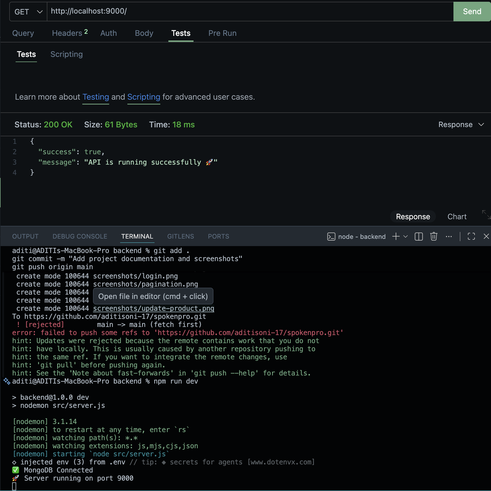

# 🚀 Product Management API

A RESTful Product Management API built with **Node.js**, **Express.js**, **MongoDB**, and **JWT Authentication**.

---

# 📸 Project Demo

## 🏠 Home Endpoint

---

## 👤 User Registration

---

## 🔐 User Login

---

## ➕ Create Product

---

## 📦 Get All Products

---

## 🔍 Search Products

---

## 📄 Pagination

---

## ✏️ Update Product

---

## 🗑 Delete Product

---

# ✨ Features

- User Registration
- User Login
-