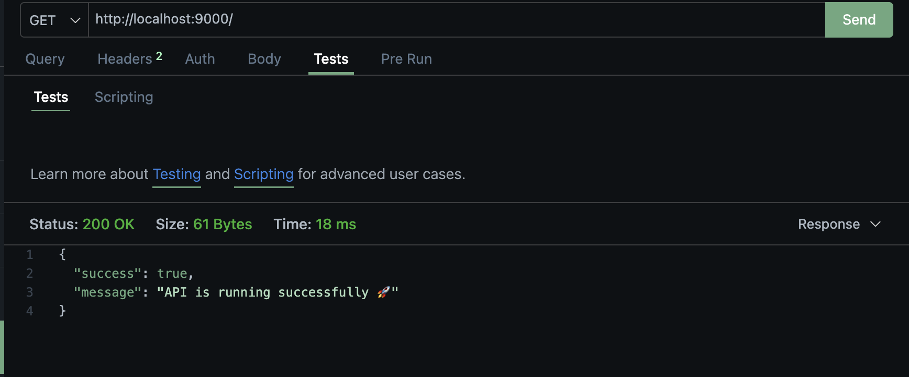
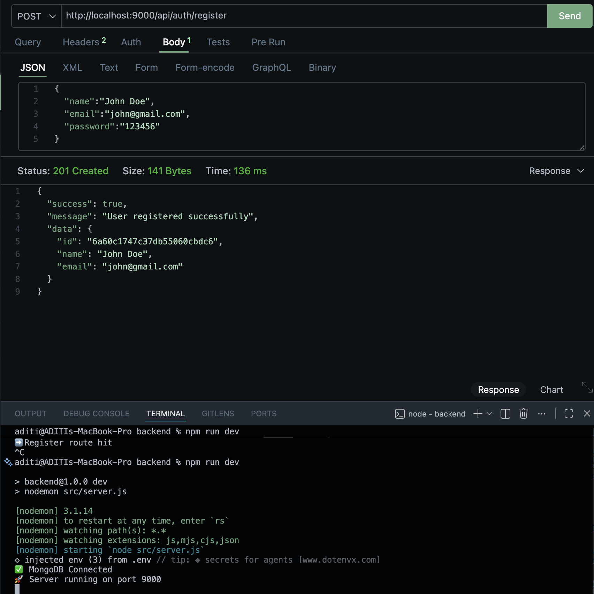
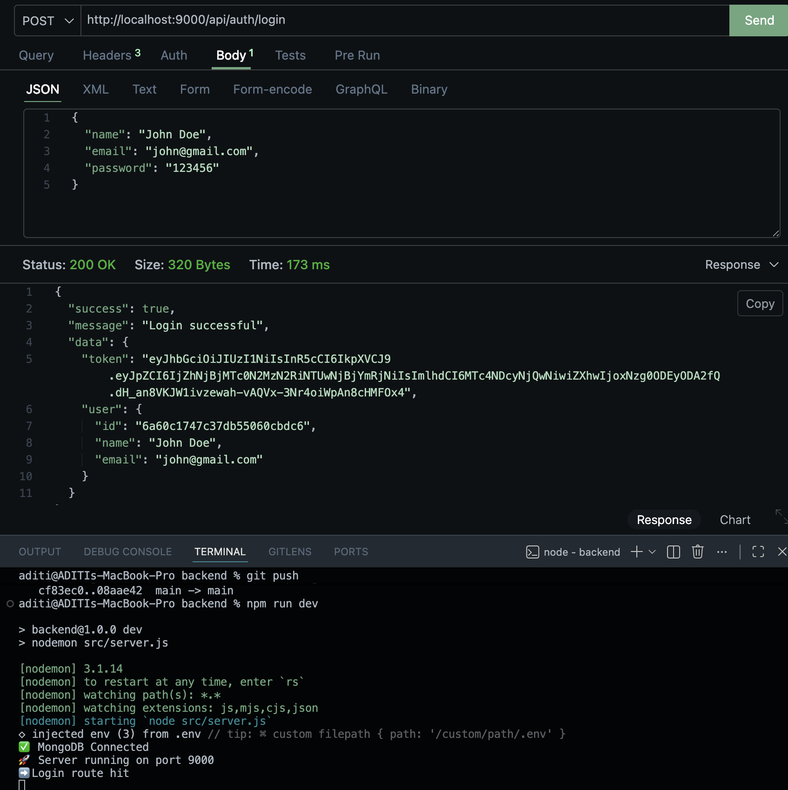
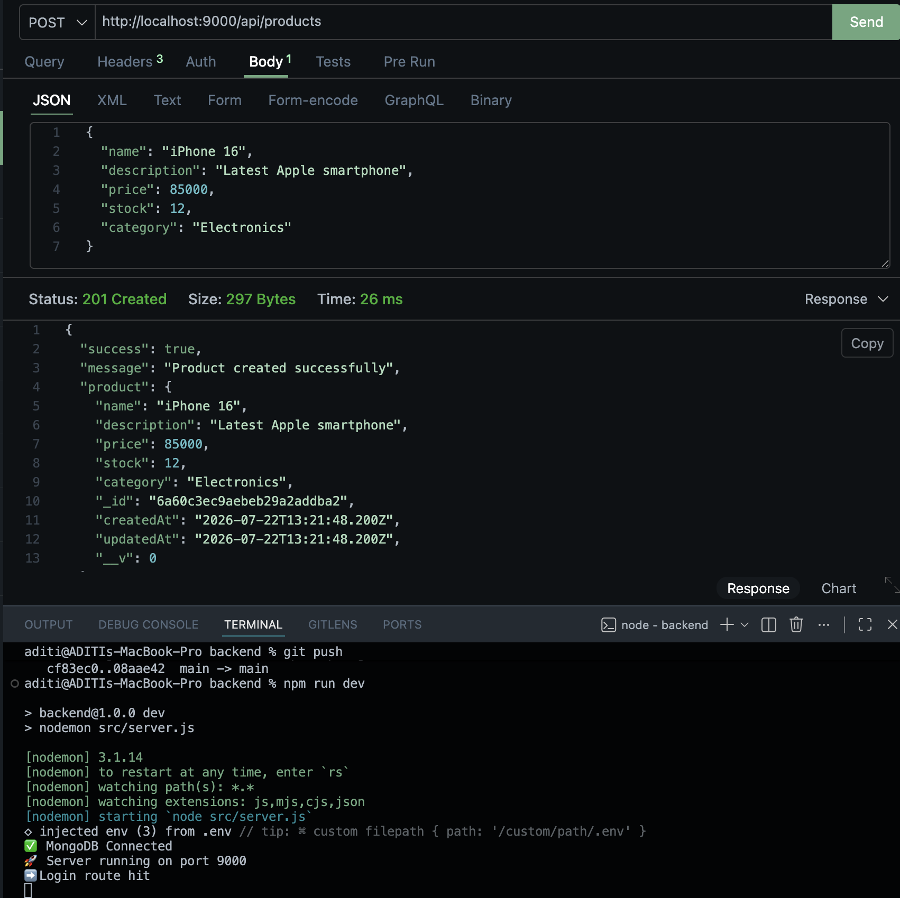
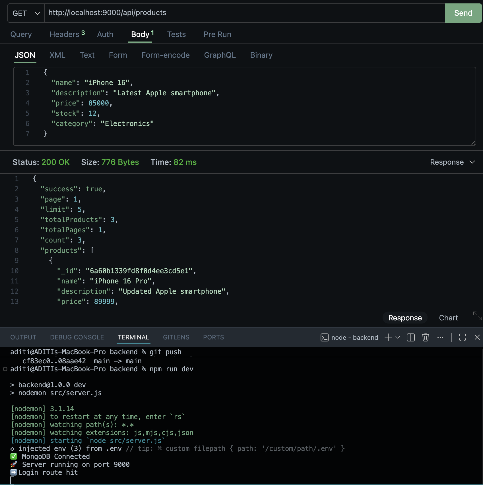
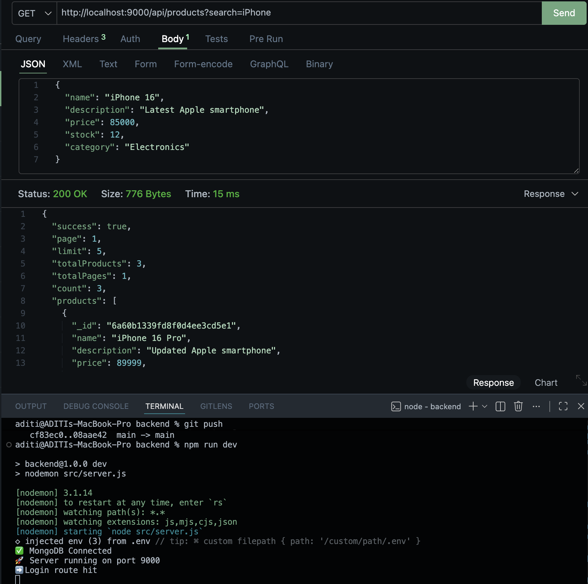
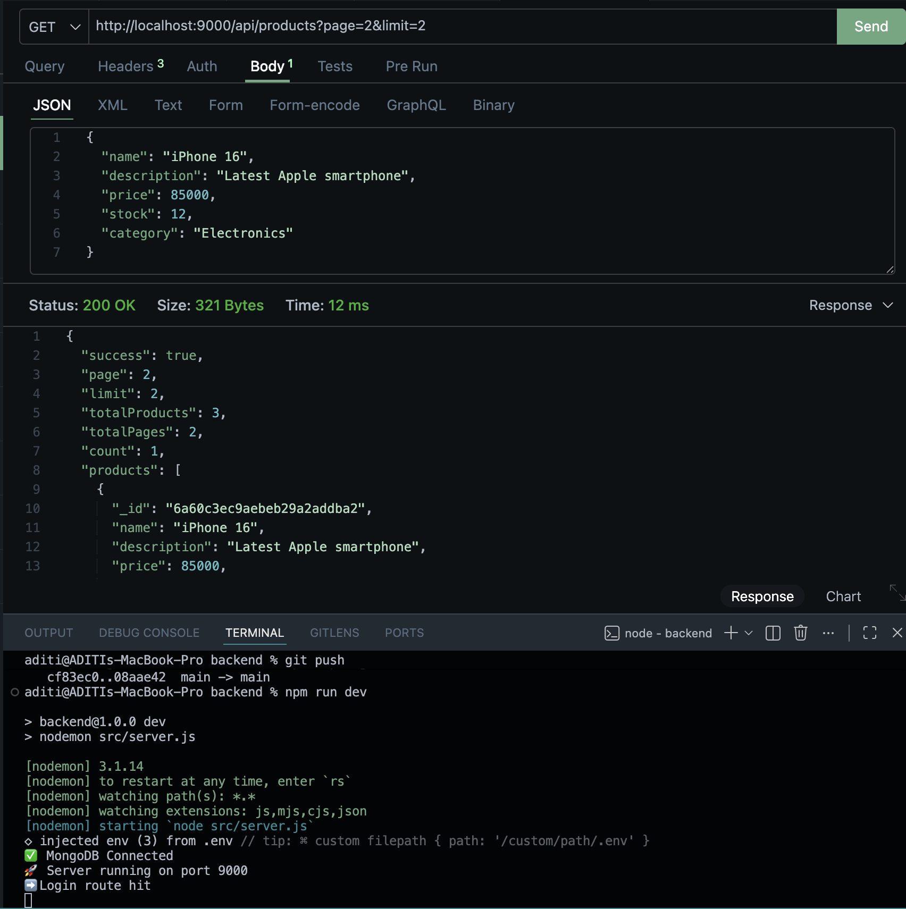
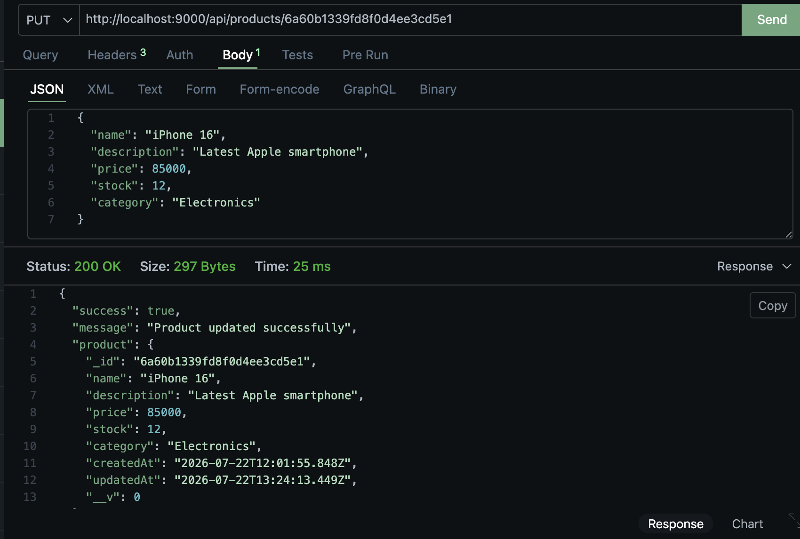
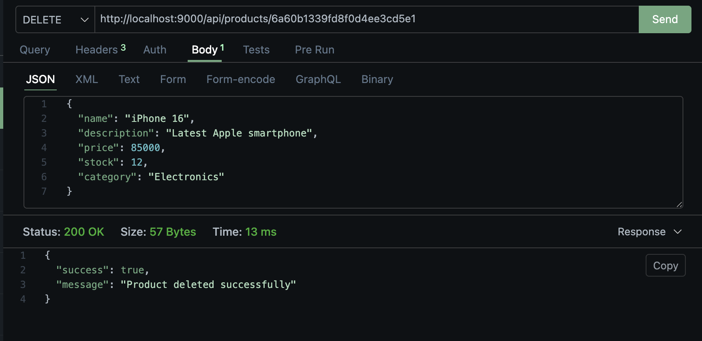

# 🚀 Product Management REST API

A secure and scalable REST API built with **Node.js**, **Express.js**, **MongoDB Atlas**, and **JWT Authentication**. The API supports user authentication and complete CRUD operations for product management with search, pagination, and protected routes.

> **Live API:** https://spokenpro-api.onrender.com

---

# 📸 API Demo

## 🏠 Home Endpoint



---

## 👤 Register User



---

## 🔐 Login User



---

## ➕ Create Product



---

## 📦 Get All Products



---

## 🔍 Search Products



---

## 📄 Pagination



---

## ✏️ Update Product



---

## 🗑 Delete Product



---

# ✨ Features

- 🔐 User Registration & Login
- 🔑 JWT Authentication
- 🔒 Protected Routes
- 🔐 Password Hashing with bcrypt
- 📦 Product CRUD Operations
- 🔍 Search Products
- 📄 Pagination
- ⚠️ Centralized Error Handling
- 🗂️ MVC Architecture
- ☁️ MongoDB Atlas Integration
- 🚀 Deployed on Render

---

# 🛠 Tech Stack

- Node.js
- Express.js
- MongoDB Atlas
- Mongoose
- JWT (jsonwebtoken)
- bcryptjs
- dotenv

---

# 🌐 Live API

**Base URL**

```text
https://spokenpro-api.onrender.com
```

The API can be tested using **Postman**, **Bruno**, **Insomnia**, or any REST API client.

---

# 🚀 API Endpoints

## 1️⃣ Check Server Status

**GET**

```text
https://spokenpro-api.onrender.com/
```

Returns the API status.

---

## 2️⃣ Register User

**POST**

```text
https://spokenpro-api.onrender.com/api/auth/register
```

Sample Body

```json
{
  "name": "John Doe",
  "email": "john@example.com",
  "password": "Password123"
}
```

---

## 3️⃣ Login User

**POST**

```text
https://spokenpro-api.onrender.com/api/auth/login
```

Sample Body

```json
{
  "email": "john@example.com",
  "password": "Password123"
}
```

Returns a JWT token.

---

## 4️⃣ Get All Products

**GET**

```text
https://spokenpro-api.onrender.com/api/products
```

---

## 5️⃣ Search Products

**GET**

```text
https://spokenpro-api.onrender.com/api/products?search=iphone
```

---

## 6️⃣ Pagination

**GET**

```text
https://spokenpro-api.onrender.com/api/products?page=1&limit=5
```

---

## 7️⃣ Get Product by ID

**GET**

```text
https://spokenpro-api.onrender.com/api/products/:id
```

Replace `:id` with the product ID.

---

## 8️⃣ Create Product (Protected)

**POST**

```text
https://spokenpro-api.onrender.com/api/products
```

Headers

```text
Authorization: Bearer <JWT_TOKEN>
Content-Type: application/json
```

Sample Body

```json
{
  "name": "iPhone 16",
  "description": "Latest Apple smartphone",
  "price": 85000,
  "stock": 12,
  "category": "Electronics"
}
```

---

## 9️⃣ Update Product (Protected)

**PUT**

```text
https://spokenpro-api.onrender.com/api/products/:id
```

Headers

```text
Authorization: Bearer <JWT_TOKEN>
Content-Type: application/json
```

Sample Body

```json
{
  "price": 90000,
  "stock": 20
}
```

---

## 🔟 Delete Product (Protected)

**DELETE**

```text
https://spokenpro-api.onrender.com/api/products/:id
```

Headers

```text
Authorization: Bearer <JWT_TOKEN>
```

---

# 🔐 Authentication

Protected endpoints require a valid JWT token.

### Step 1

Register a user.

### Step 2

Login using the registered credentials.

### Step 3

Copy the JWT token returned from the login endpoint.

### Step 4

Include the token in the request headers:

```text
Authorization: Bearer <YOUR_JWT_TOKEN>
```

---

# 📋 API Summary

| Method | Endpoint | Access |
|---------|----------|--------|
| GET | `/` | 🔓 Public |
| POST | `/api/auth/register` | 🔓 Public |
| POST | `/api/auth/login` | 🔓 Public |
| GET | `/api/products` | 🔓 Public |
| GET | `/api/products?search=iphone` | 🔓 Public |
| GET | `/api/products?page=1&limit=5` | 🔓 Public |
| GET | `/api/products/:id` | 🔓 Public |
| POST | `/api/products` | 🔒 JWT Required |
| PUT | `/api/products/:id` | 🔒 JWT Required |
| DELETE | `/api/products/:id` | 🔒 JWT Required |

---

# 📂 Project Structure

```text
backend/
│
├── screenshots/
├── src/
│   ├── config/
│   ├── controllers/
│   ├── middleware/
│   ├── models/
│   ├── routes/
│   ├── app.js
│   └── server.js
│
├── package.json
├── README.md
└── .env.example
```

---

# ⚙️ Installation

Clone the repository:

```bash
git clone https://github.com/aditisoni-17/spokenpro.git
```

Navigate to the project:

```bash
cd backend
```

Install dependencies:

```bash
npm install
```

Create a `.env` file:

```env
PORT=5000
MONGO_URI=your_mongodb_atlas_connection_string
JWT_SECRET=your_secret_key
```

Start the server:

```bash
npm run dev
```

or

```bash
npm start
```

---

# 📌 Assignment Highlights

- ✅ JWT Authentication
- ✅ Password Hashing (bcrypt)
- ✅ Product CRUD APIs
- ✅ Search Functionality
- ✅ Pagination
- ✅ MongoDB Schema Design
- ✅ Centralized Error Handling
- ✅ RESTful API Design
- ✅ Render Deployment
- ✅ MongoDB Atlas Integration

---

# 👩‍💻 Author

**Aditi Soni**

GitHub: https://github.com/aditisoni-17

---

⭐ If you found this project useful, consider giving it a star.
